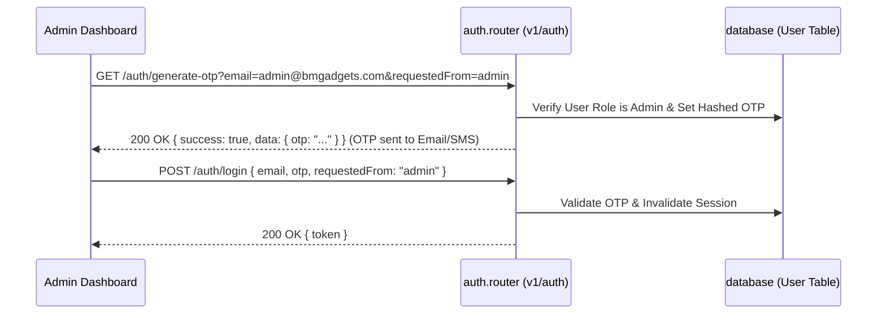

# Admin Authentication & Analytics Dashboard

This section covers the admin OTP login flow, global store statistics, and chart report queries.

---

## 1. Authentication Flow (OTP-Based)

Admin authentication uses a passwordless login system. The key requirement is setting `requestedFrom: "admin"` in both OTP request and verification steps. If this flag is omitted or incorrect, the backend blocks the request.



### Steps to Implement

#### Step A: Request OTP Code
*   **Endpoint**: `GET /auth/generate-otp`
*   **Query Parameters**:
    ```typescript
    interface GenerateOtpQuery {
      phone?: string;          // Admin phone number
      email?: string;          // Admin email address
      requestedFrom: 'admin';  // CRITICAL: Must be "admin"
    }
    ```
*   **API Response (Development Mode)**:
    In development mode, the OTP is returned directly in the response payload for testing.
    ```json
    {
      "success": true,
      "message": "OTP generated successfully",
      "data": {
        "otp": "59483"
      }
    }
    ```

#### Step B: Validate OTP & Login
*   **Endpoint**: `POST /auth/login`
*   **Request Body**:
    ```json
    {
      "email": "admin@bmgadgets.com",
      "otp": "59483",
      "requestedFrom": "admin"
    }
    ```
*   **API Response**:
    ```json
    {
      "success": true,
      "message": "Login successful",
      "data": {
        "token": "eyJhbGciOiJIUzI1NiIsInR5cCI6IkpXVCJ9..."
      }
    }
    ```

---

## 2. Dashboard Statistics & KPI Cards

Upon successful login, the admin is presented with the main Overview dashboard. Call these four endpoints to populate dashboard metric cards:

### A. General Catalog Count
Returns total products, categories, and brands created within the period, along with compared percentages from the previous period (e.g., this week vs. last week).
*   **Endpoint**: `GET /products/stats`
*   **Query Parameters**:
    *   `period`: `"Daily"` | `"Weekly"` | `"Monthly"` | `"Quarterly"` (default: `"Weekly"`)
*   **API Response**:
    ```json
    {
      "success": true,
      "message": "Product stats fetched successfully",
      "data": {
        "totalProducts": 42,
        "totalCategories": 5,
        "totalBrands": 8,
        "percentages": {
          "products": 12.5,
          "categories": 0,
          "brands": -2.3
        },
        "period": "Weekly",
        "periodRange": {
          "start": "2026-07-27T00:00:00.000Z",
          "end": "2026-08-02T23:59:59.999Z"
        }
      }
    }
    ```

### B. Low Stock Warning Table
Displays variants and products that have stock levels lower than the custom warning threshold.
*   **Endpoint**: `GET /products/low-stock`
*   **Query Parameters**:
    *   `threshold`: quantity threshold (default: `10`)
*   **API Response**:
    ```json
    {
      "success": true,
      "message": "Low stock products fetched successfully",
      "data": [
        {
          "id": "variant_id_1",
          "weightInGrams": 500,
          "product": {
            "name": "Organic Almonds Premium"
          },
          "variant": {
            "name": "500g Pack"
          },
          "warehouseStocks": [
            {
              "warehouse": { "name": "Mumbai Main Hub" },
              "quantity": 3
            }
          ]
        }
      ]
    }
    ```

### C. Top Categories by Revenue
Used for displaying a pie/donut chart representing sales breakdown by department.
*   **Endpoint**: `GET /products/top-categories`
*   **Query Parameters**:
    *   `limit`: Number of items (default: `5`)
    *   `period`: `"Weekly"` | `"Monthly"` | `"Quarterly"`
*   **API Response**:
    ```json
    {
      "success": true,
      "message": "Top categories fetched successfully",
      "data": [
        {
          "categoryId": "cat_id_1",
          "name": "Electronics",
          "revenue": 145000
        }
      ]
    }
    ```

### D. Top-Selling Products
Provides listing metrics showing product popularity.
*   **Endpoint**: `GET /products/top-products`
*   **Query/Limit Parameters**:
    *   `limit`: number of products (default: `5`)
    *   `period`: `"Weekly"` | `"Monthly"` | `"Quarterly"`
*   **API Response**:
    ```json
    {
      "success": true,
      "message": "Top products fetched successfully",
      "data": [
        {
          "productId": "prod_id_1",
          "name": "SuperFit Smartwatch V2",
          "quantity": 124,
          "revenue": 372000
        }
      ]
    }
    ```

---

## 3. Graphical Sales Reports & Timeseries

For graphing monthly and daily performance, query the primary store vendor profile (marked as `isOriginO: true`). The dashboard uses this vendor profile ID to draw line and bar charts.

> [!NOTE]
> Since this is a single-vendor setup, the store owner's catalog is owned by the seed vendor profile. Retrieve the vendor profile ID via `GET /vendors?limit=1` or `GET /vendors/me` to use in the following endpoints.

### A. Sales & Revenue Timeseries (Line Chart)
Retrieves day-by-day sales data. Useful for building a dual-axis Line Chart showing `revenue` (represented on left Y-axis) and `orders` volume (on right Y-axis) over time.
*   **Endpoint**: `GET /vendors/:vendorId/reports/sales-timeseries`
*   **Query Parameters**:
    *   `days`: timeframe in days (e.g., `7` for weekly, `30` for monthly, `90` for quarterly)
*   **API Response**:
    ```json
    {
      "success": true,
      "data": [
        {
          "date": "2026-08-01",
          "revenue": 45000,
          "orders": 12
        },
        {
          "date": "2026-08-02",
          "revenue": 67000,
          "orders": 19
        }
      ]
    }
    ```

### B. Category Breakdown (Bar Chart)
Shows sales performance metrics across categories for the vendor.
*   **Endpoint**: `GET /vendors/:vendorId/reports/revenue-by-category`
*   **Query Parameters**:
    *   `days`: timeframe in days (default: `30`)
*   **API Response**:
    ```json
    {
      "success": true,
      "data": [
        {
          "categoryId": "cat_id_1",
          "categoryName": "Dry Fruits",
          "revenue": 89000
        }
      ]
    }
    ```

### C. Order Status Distribution (Donut Chart)
Used to display order statuses summary for fulfillment tracking.
*   **Endpoint**: `GET /vendors/:vendorId/reports/orders-by-status`
*   **API Response**:
    ```json
    {
      "success": true,
      "data": [
        {
          "status": "PAID",
          "count": 142
        },
        {
          "status": "INITIALIZED",
          "count": 18
        },
        {
          "status": "PENDING",
          "count": 5
        }
      ]
    }
    ```
