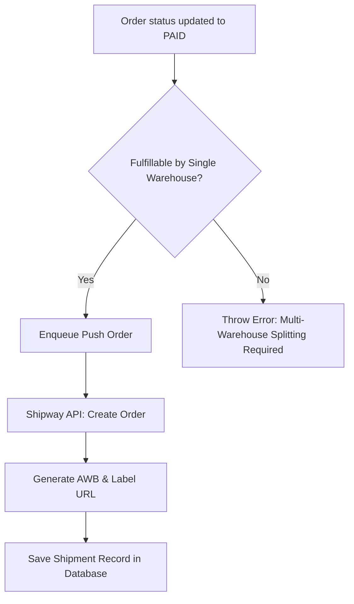

# Order Fulfillment & Shipway Logistics

This section describes how the admin manages customer orders, updates payment/fulfillment statuses, generates shipping labels, and interacts with the Shipway carrier API.

---

## 1. Order Management & Status Updates

Customer checkout records start as `PENDING` (awaiting payment). Admins monitor these orders and perform status updates (e.g., handling manual Cash on Delivery check-ins or order cancellations).

### A. List and Filter Customer Orders
*   **Endpoint**: `GET /orders`
*   **Permissions Required**: `ORDER_MANAGEMENT` (READ)
*   **Query Parameters**:
    *   `page` / `limit`: Pagination parameters.
    *   `status`: Filter by status (`"PENDING"` | `"INITIALIZED"` | `"PAID"` | `"CANCELLED"`).
    *   `paymentType`: Filter by payment mode (`"COD"` | `"ONLINE"`).
*   **API Response**:
    ```json
    {
      "success": true,
      "message": "Orders fetched successfully",
      "data": {
        "results": [
          {
            "id": "order_id_123",
            "status": "PAID",
            "paymentType": "ONLINE",
            "subtotal": 2999.00,
            "gst": 539.82,
            "couponDiscount": 200.00,
            "shippingCost": 80.00,
            "createdAt": "2026-08-01T12:00:00.000Z",
            "createdBy": {
              "id": "customer_id",
              "user": {
                "name": "John Doe",
                "phone": "9876543210"
              }
            }
          }
        ],
        "totalResults": 45,
        "totalPages": 5,
        "page": 1
      }
    }
    ```

### B. View Detailed Order with Line Items
*   **Endpoint**: `GET /orders/:id`
*   **API Response**:
    Contains details about individual line items, variant prices, and shipping addresses.
    ```json
    {
      "success": true,
      "message": "Order fetched successfully",
      "data": {
        "id": "order_id_123",
        "status": "PAID",
        "address": {
          "addressLine1": "Flat 405, Heights Residency",
          "city": "Mumbai",
          "state": "Maharashtra",
          "zipcode": "400001",
          "country": "India"
        },
        "items": [
          {
            "id": "item_id_1",
            "quantity": 2,
            "price": {
              "price": 1500,
              "discountedPrice": 1400,
              "productVariant": {
                "weightInGrams": 200,
                "product": {
                  "name": "SuperFit Smartwatch V2"
                }
              }
            },
            "shipmentStatus": "CREATED",
            "awbNumber": "98274981740",
            "carrierId": "24"
          }
        ]
      }
    }
    ```

### C. Update Order Details
*   **Endpoint**: `PATCH /orders/:id`
*   **Permissions Required**: `ORDER_MANAGEMENT` (WRITE)
*   **Request Payload**:
    ```json
    {
      "status": "PAID" // Update status manually for bank transfers/COD completions
    }
    ```

---

## 2. Shipway Shipment Dispatch Workflow

Once an order moves to the `PAID` state, it is ready for shipment dispatch. The backend uses a queue worker to validate and push orders to the Shipway system.



### A. Manual Queue Dispatch Trigger
If a background push fails or if the admin wants to force a dispatch manually, trigger this action:
*   **Endpoint**: `POST /orders/test-push-order`
*   **Permissions Required**: `ORDER_MANAGEMENT` (WRITE)
*   **Request Payload**:
    ```json
    {
      "orderId": "order_id_123"
    }
    ```
*   **Fulfillment Check**:
    The system verifies if the order is fulfillable from a single warehouse. If clean stock matching passes, it adds the task to the queue worker.
*   **API Response**:
    ```json
    {
      "success": true,
      "message": "Order enqueued for pushing to Shipway"
    }
    ```

### B. Query Tracking Shipments & AWB Labels
Monitor active shipments created under Shipway.
*   **List Shipments**: `GET /shipments`
*   **Get Shipments by Order**: `GET /shipments/by-order/:orderId`
*   **Response Fields**:
    ```json
    {
      "success": true,
      "data": [
        {
          "id": "shipment_id_888",
          "shipwayOrderId": "100234_chunk0",
          "awb": "98274981740",
          "carrierId": "24",
          "status": "CREATED",
          "labelUrl": "https://shipway.com/labels/label_98274981740.pdf",
          "trackingStatus": "IN_TRANSIT",
          "expectedDelivery": "2026-08-05T18:00:00.000Z"
        }
      ]
    }
    ```

---

## 3. Direct Shipway Courier Operations

Admins can configure rates, schedule carrier pickups, and query logistics serviceability directly through these proxy endpoints.

### A. Schedule Carrier Pickup
Request a courier agent to pick up package boxes from the warehouse.
*   **Endpoint**: `POST /shipway/pickup`
*   **Request Payload**:
    ```json
    {
      "pickup_date": "2026-08-03",
      "pickup_time": "14:00:00",
      "office_close_time": "18:00:00",
      "package_count": 2,
      "carrier_id": "24",
      "warehouse_id": "65cd1b24e6a8d80f86cf6666",
      "return_warehouse_id": "65cd1b24e6a8d80f86cf6666",
      "payment_type": "prepaid",
      "order_ids": ["order_id_123"]
    }
    ```
*   **Response**:
    ```json
    {
      "success": true,
      "message": "Pickup created successfully",
      "data": {
        "pickup_id": "PU_87261947",
        "status": "scheduled"
      }
    }
    ```

### B. List Available Couriers
*   **Endpoint**: `GET /shipway/carriers`
*   **Response**: Lists carrier codes, names, and integration methods (e.g., Bluedart, Delhivery, DTDC).

### C. Rates and Serviceability Calculator
Before dispatch, check if a target pincode supports Cash on Delivery (COD) or prepaid shipping.
*   **Check Serviceability**: `GET /shipway/serviceability?pincode=400001&paymentType=C` (where paymentType `P` = prepaid, `C` = COD)
*   **Calculate Shipway Rates**: `GET /shipway/rates?fromPincode=110001&toPincode=400001&paymentType=prepaid`
