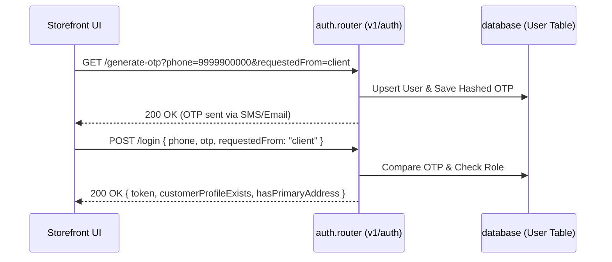

# Storefront API Integration: Auth, Products & Wishlist

This document details the frontend implementation for customer authentication, product catalog browsing (with filters and pagination), and real-time favorites/wishlist sync, matching the **OriginO** backend endpoints.

---

## 1. Authentication Flow (OTP-Based)

Authentication uses a passwordless OTP (One-Time Password) system. The client receives a JWT session token upon successful verification.



### Steps to Implement

#### Step A: Request OTP Code
Call this API to send a 5-digit verification code. (In a development environment, the OTP is returned in the API response JSON for convenience).

*   **Endpoint**: `GET /auth/generate-otp`
*   **Query Parameters**:
    ```typescript
    interface GenerateOtpQuery {
      phone?: string;          // E.164 phone string
      email?: string;          // User email address
      requestedFrom: 'client'; // Must be "client" for storefront users
    }
    ```
*   **Response**:
    ```json
    {
      "success": true,
      "message": "OTP generated successfully",
      "data": {
        "otp": "54321" // Only returned in DEVELOPMENT environment
      }
    }
    ```

#### Step B: Verification & Login
Submit the OTP sent to the user to receive the session token.

*   **Endpoint**: `POST /auth/login`
*   **Request Body**:
    ```json
    {
      "phone": "9999900000",
      "otp": "54321",
      "requestedFrom": "client"
    }
    ```
*   **Response**:
    ```json
    {
      "success": true,
      "message": "Login successful",
      "data": {
        "token": "eyJhbGciOiJIUzI1NiIsIn...",
        "customerProfileExists": true,
        "hasPrimaryAddress": true
      }
    }
    ```
*   **Frontend Action**: Save the `token` in the `authStore` (which writes to localStorage) and redirect the user. If `customerProfileExists` is false, redirect them to a profile completion form.

---

## 2. Product Catalog Display & Pagination

The products page fetches data dynamically with pagination, sorting, and multi-criteria filters.

### API Details
*   **Endpoint**: `GET /products`
*   **Query Parameters**:
    *   `page`: Page number (default: `1`)
    *   `limit`: Items per page (default: `10`)
    *   `sort_by`: Field to sort by (`createdAt`, `orderCount`, etc.)
    *   `sort_order`: Sort direction (`asc` or `desc`)
    *   `search`: Text query for search bar
    *   `categoryId`: Filter by specific category
    *   `minPrice` / `maxPrice`: Price range filters
    *   `inStock`: Boolean string (`"true"`/`"false"`)

### React hook with TanStack Query
Here is the implementation of a reusable query hook for products:

```typescript
import { useQuery } from '@tanstack/react-query';
import apiClient from './api.client';

export interface ProductFilters {
  page?: number;
  limit?: number;
  search?: string;
  categoryId?: string;
  minPrice?: number;
  maxPrice?: number;
  inStock?: boolean;
  sort_by?: string;
  sort_order?: 'asc' | 'desc';
}

export const useProducts = (filters: ProductFilters) => {
  return useQuery({
    queryKey: ['products', filters],
    queryFn: async () => {
      const response = await apiClient.get('/products', { params: filters });
      return response.data; // { results: Product[], totalResults: number, page: number, limit: number, totalPages: number }
    },
  });
};
```

---

## 3. Product Detail Page
When a user clicks on a product card, route them to `/products/[id]`. Fetch the full product object including all variants, combos, and approved reviews.

*   **Endpoint**: `GET /products/:id`
*   **Response Structure (Key Fields)**:
    ```typescript
    interface ProductDetail {
      id: string;
      name: string;
      description: string;
      thumbnailImageUrl: string;
      imageUrls: string[];
      ingredients: string;
      usageInstructions: string;
      certifications: ('ORGANIC_CERTIFIED' | 'VEGAN' | 'NON_GMO' | 'GLUTEN_FREE')[];
      varients: {
        id: string;
        discountPercentage: number;
        weightInGrams: number;
        variant: { name: string }; // e.g. "500g", "1kg"
        prices: {
          id: string;
          price: number;
          discountedPrice: number;
        }[];
      }[];
      reviews: {
        id: string;
        rating: number;
        message: string;
        createdBy: { user: { phone: string } };
      }[];
    }
    ```

---

## 4. Favorites & Wishlist Sync

The wishlist state is synced to the database if the user is authenticated.

*   **Get Wishlist**: `GET /users/wishlist` (Requires Authorization Header)
*   **Add Item**: `POST /users/wishlist`
    *   **Body**:
        ```json
        {
          "productVariantId": "variant_mongodb_id", // If adding variant
          "productComboId": null                     // Or combo ID
        }
        ```
*   **Remove Item**: `DELETE /users/wishlist/:targetId` where `:targetId` is the `wishlistItemId` returned in the wishlist query response.

### Wishlist React Hook Wrapper
```typescript
import { useMutation, useQuery, useQueryClient } from '@tanstack/react-query';
import apiClient from './api.client';

export const useWishlist = () => {
  const queryClient = useQueryClient();

  const query = useQuery({
    queryKey: ['wishlist'],
    queryFn: () => apiClient.get('/users/wishlist'),
  });

  const addToWishlist = useMutation({
    mutationFn: (payload: { productVariantId?: string; productComboId?: string }) =>
      apiClient.post('/users/wishlist', payload),
    onSuccess: () => queryClient.invalidateQueries({ queryKey: ['wishlist'] }),
  });

  const removeFromWishlist = useMutation({
    mutationFn: (wishlistItemId: string) =>
      apiClient.delete(`/users/wishlist/${wishlistItemId}`),
    onSuccess: () => queryClient.invalidateQueries({ queryKey: ['wishlist'] }),
  });

  return { wishlist: query.data, addToWishlist, removeFromWishlist };
};
```
