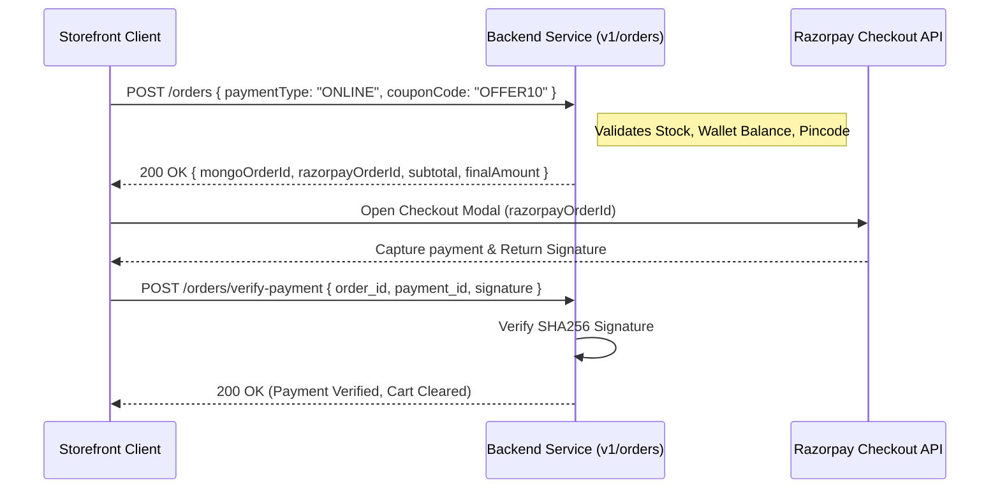

# Storefront Cart, Checkout & Razorpay Payment Integration

This document outlines the storefront implementation of shopping cart synchronization, checkout price calculations, and the complete online payment flow using Razorpay SDK.

---

## 1. Unified Cart State Management

The storefront supports two states of shopping carts:
1.  **Guest Cart**: Local storage database managed by Zustand.
2.  **User Cart**: Synchronized database cart synced via APIs.

### The Hybrid Cart Store (Zustand)

```typescript
import { create } from 'zustand';
import { persist } from 'zustand/middleware';
import apiClient from '@/services/api.client';
import { useAuthStore } from './useAuthStore';

interface LocalCartItem {
  productVariantId?: string;
  productComboId?: string;
  quantity: number;
}

interface CartState {
  items: LocalCartItem[];
  addItem: (item: Omit<LocalCartItem, 'quantity'>, qty?: number) => Promise<void>;
  updateQty: (itemId: string, qty: number) => Promise<void>;
  removeItem: (itemId: string) => Promise<void>;
  syncLocalCartToServer: () => Promise<void>;
  clearCart: () => void;
}

export const useCartStore = create<CartState>()(
  persist(
    (set, get) => ({
      items: [],
      addItem: async (item, qty = 1) => {
        const token = useAuthStore.getState().token;
        if (token) {
          // Sync with Server DB
          await apiClient.post('/users/cart', { ...item, quantity: qty });
        } else {
          // Local State
          const currentItems = get().items;
          const existingIndex = currentItems.findIndex(
            (i) => i.productVariantId === item.productVariantId && i.productComboId === item.productComboId
          );
          if (existingIndex > -1) {
            currentItems[existingIndex].quantity += qty;
          } else {
            currentItems.push({ ...item, quantity: qty });
          }
          set({ items: [...currentItems] });
        }
      },
      updateQty: async (itemId, qty) => {
        const token = useAuthStore.getState().token;
        if (token) {
          // Update DB (itemId is the CartItem DB _id)
          await apiClient.patch(`/users/cart/${itemId}`, { quantity: qty });
        } else {
          // Update Local
          const currentItems = get().items.map(item => {
            const isMatch = item.productVariantId === itemId || item.productComboId === itemId;
            return isMatch ? { ...item, quantity: qty } : item;
          });
          set({ items: currentItems });
        }
      },
      removeItem: async (itemId) => {
        const token = useAuthStore.getState().token;
        if (token) {
          // Delete from DB
          await apiClient.delete(`/users/cart/${itemId}`);
        } else {
          // Delete Local
          const currentItems = get().items.filter(
            (i) => i.productVariantId !== itemId && i.productComboId !== itemId
          );
          set({ items: currentItems });
        }
      },
      syncLocalCartToServer: async () => {
        const localItems = get().items;
        if (localItems.length > 0) {
          for (const item of localItems) {
            await apiClient.post('/users/cart', item);
          }
          set({ items: [] }); // Clear local cart after syncing
        }
      },
      clearCart: () => set({ items: [] }),
    }),
    {
      name: 'origino-cart-storage',
    }
  )
);
```

---

## 2. Buy Now Flow

To implement "Buy Now" (skipping the persistent cart):
1.  Temporarily save the target product variant/combo details in a transient Zustand state variable `buyNowItem`.
2.  Redirect the user directly to `/checkout`.
3.  On the checkout page, check if `buyNowItem` is populated. If yes, display its summary and bypass the cart service calculations by passing the single item representation to the checkout UI.

---

## 3. Checkout Calculations (Price Summary)

Before placing an order, show an breakdown of items, shipping fees, discounts, and tax liabilities.

*   **Endpoint**: `GET /orders/price-summary`
*   **Query Parameters**:
    ```typescript
    interface SummaryQuery {
      couponCode?: string; // Optional coupon to test discount eligibility
    }
    ```
*   **Response**:
    ```json
    {
      "success": true,
      "data": {
        "subTotal": 1200.00,
        "couponDiscount": 150.00,
        "gst": 216.00,
        "shippingCost": 50.00,
        "finalAmount": 1316.00,
        "isFirstOrder": false
      }
    }
    ```

---

## 4. Order Creation & Razorpay Checkout Integration

To process payments securely online, follow this detailed integration flow.



### Steps to Implement

#### Step A: Initiate Order
Send the selected payment method and coupon code.

*   **Endpoint**: `POST /orders`
*   **Request Body**:
    ```json
    {
      "paymentType": "ONLINE", 
      "couponCode": "SUMMER50"
    }
    ```
*   **Response (for ONLINE)**:
    ```json
    {
      "success": true,
      "data": {
        "mongoOrderId": "65b9d3ef841ae00201fae29c",
        "razorpayOrderId": "order_NXg9P8a1u284ka",
        "paymentType": "ONLINE",
        "subtotal": 1200.00,
        "shippingCost": 50.00
      }
    }
    ```

#### Step B: Mount Razorpay Checkout Modal
Load the official Razorpay script `<script src="https://checkout.razorpay.com/v1/checkout.js"></script>` and open the payment interface.

```typescript
const openRazorpayModal = (orderData: { razorpayOrderId: string; finalAmount: number; mongoOrderId: string }) => {
  const options = {
    key: process.env.NEXT_PUBLIC_RAZORPAY_KEY_ID, // Enter local client key ID
    amount: Math.ceil(orderData.finalAmount * 100), // In Paise (INR * 100)
    currency: 'INR',
    name: 'OriginO E-commerce',
    description: 'Purchase Order payment',
    order_id: orderData.razorpayOrderId,
    handler: async function (response: any) {
      // Payment Successful - callback triggers client-side verification
      try {
        await apiClient.post('/orders/verify-payment', {
          order_id: response.razorpay_order_id,
          payment_id: response.razorpay_payment_id,
          signature: response.razorpay_signature,
        });
        
        // Clear local cart store
        useCartStore.getState().clearCart();
        
        // Redirect to success / tracking page
        window.location.href = `/orders/${orderData.mongoOrderId}/success`;
      } catch (err: any) {
        alert(`Payment verification failed: ${err.message}`);
      }
    },
    prefill: {
      name: "Customer Name",
      email: "customer@example.com",
      contact: "9999900000"
    },
    theme: {
      color: '#16a34a' // Primary organic green
    }
  };

  const rzp = new (window as any).Razorpay(options);
  rzp.open();
};
```

#### Step C: Handle COD and Zero-Pay Orders
For Cash on Delivery (`paymentType: "COD"`) or when wallet credits fully cover the order amount, the backend responds with `status: "INITIALIZED"` and returns no `razorpayOrderId`. In this case, bypass the Razorpay SDK flow and immediately redirect the user to `/orders/[id]/success`.
