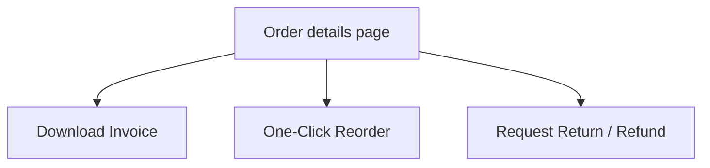

# Storefront Dynamic Enhancements: Search, CMS, Reviews & Post-Order Actions

This document details advanced dynamic features that elevate the storefront experience, including real-time search autocomplete, infinite scrolling, full CMS layout widgets mapping, customer review postings, and self-service post-order actions (invoices, reorders, returns).

---

## 1. Real-Time Search Suggestions & Debouncing

To minimize API requests while providing instant search results as the user types, implement debounced autocomplete.

*   **Endpoint**: `GET /products/search-suggestions?search=...`
*   **Response**:
    ```json
    {
      "success": true,
      "data": [
        { "id": "65b9d3ef...", "name": "BMGadgets Bluetooth Headphones" },
        { "id": "65b9d3f0...", "name": "BMGadgets Active Sneakers" }
      ]
    }
    ```

### React Implementation (Hook & UI Dropdown)

```typescript
import { useState, useEffect } from 'react';
import { useQuery } from '@tanstack/react-query';
import apiClient from '@/services/api.client';

// Custom Debouncing Hook
export function useDebounce<T>(value: T, delay: number = 300): T {
  const [debouncedValue, setDebouncedValue] = useState<T>(value);

  useEffect(() => {
    const handler = setTimeout(() => setDebouncedValue(value), delay);
    return () => clearTimeout(handler);
  }, [value, delay]);

  return debouncedValue;
}

// Autocomplete Search Component
export const SearchBar = () => {
  const [query, setQuery] = useState('');
  const debouncedQuery = useDebounce(query, 300);

  const { data: suggestions = [], isFetching } = useQuery({
    queryKey: ['search-suggestions', debouncedQuery],
    queryFn: async () => {
      if (!debouncedQuery.trim()) return [];
      const response: any = await apiClient.get('/products/search-suggestions', {
        params: { search: debouncedQuery }
      });
      return response.data; // Array of items
    },
    enabled: debouncedQuery.length > 1,
  });

  return (
    <div className="relative w-full max-w-lg">
      <input
        type="text"
        value={query}
        onChange={(e) => setQuery(e.target.value)}
        placeholder="Search gadgets, accessories..."
        className="w-full px-4 py-2 border rounded-full focus:ring-2 focus:ring-green-500"
      />
      {suggestions.length > 0 && (
        <div className="absolute top-full left-0 right-0 mt-2 bg-white border border-slate-100 rounded-xl shadow-lg z-50 max-h-60 overflow-y-auto">
          {suggestions.map((item: any) => (
            <a
              key={item.id}
              href={`/products/${item.id}`}
              className="block px-4 py-3 hover:bg-slate-50 text-sm text-slate-700 font-medium"
            >
              🔍 {item.name}
            </a>
          ))}
        </div>
      )}
    </div>
  );
};
```

---

## 2. Infinite Scroll Product Grid

Instead of basic pagination buttons, infinite scroll offers a smooth user experience.

### React Integration (TanStack Query + Intersection Observer)
```typescript
import { useInfiniteQuery } from '@tanstack/react-query';
import { useInView } from 'react-intersection-observer';
import { useEffect } from 'react';
import apiClient from '@/services/api.client';
import { ProductCard } from './ProductCard';

export const InfiniteProductGrid = ({ categoryId }: { categoryId?: string }) => {
  const { ref, inView } = useInView();

  const {
    data,
    fetchNextPage,
    hasNextPage,
    isFetchingNextPage,
    status
  } = useInfiniteQuery({
    queryKey: ['infinite-products', categoryId],
    queryFn: async ({ pageParam = 1 }) => {
      const response: any = await apiClient.get('/products', {
        params: { page: pageParam, limit: 12, categoryId, active: "true" }
      });
      return response.data; // { results: Product[], totalPages: number }
    },
    initialPageParam: 1,
    getNextPageParam: (lastPage: any, allPages) => {
      const nextPage = allPages.length + 1;
      return nextPage <= lastPage.totalPages ? nextPage : undefined;
    },
  });

  useEffect(() => {
    if (inView && hasNextPage) {
      fetchNextPage();
    }
  }, [inView, hasNextPage, fetchNextPage]);

  if (status === 'pending') return <p>Loading products...</p>;

  return (
    <div>
      <div className="grid grid-cols-2 md:grid-cols-4 gap-6">
        {data?.pages.flatMap((page) => page.results).map((product: any) => (
          <ProductCard key={product.id} product={product} />
        ))}
      </div>
      
      {/* Loading Anchor Element */}
      <div ref={ref} className="h-10 flex items-center justify-center mt-8">
        {isFetchingNextPage && <p className="text-slate-400 text-sm">Loading more items...</p>}
      </div>
    </div>
  );
};
```

---

## 3. Rendering All CMS Dynamic Elements

Extend the homepage renderer (`docs/frontend-guide/5_cms_display.md`) to dynamically map remaining CMS sections:

### A. Limited Stock Countdown Slider
*   **Prisma Type**: `LimitedStock[]` (Promotes items with low inventory).
*   **UI Implementation**: Loop through items, display a progress bar showing remaining stock percentage, and attach a CSS-based countdown timer.

### B. Powered By Logotypes Grid
*   **Prisma Type**: `PoweredBy[]` (Displays trust partners, brands, or payment logos).
*   **UI Implementation**: Horizontal auto-scrolling logotype slider.
```typescript
export const PoweredByRow = ({ brands }: { brands: any[] }) => (
  <div className="bg-slate-50 py-8 overflow-hidden">
    <div className="flex space-x-12 justify-center items-center opacity-60 grayscale">
      {brands.map((b) => (
        
      ))}
    </div>
  </div>
);
```

### C. Merchant Call-To-Action Banner
*   **Prisma Type**: `VendorCta` (Promotional card asking sellers to join BMGadgets).
*   **UI Implementation**: Split row banner with a side graphics illustration, text, and an action button link redirecting to the `/vendor/register` portal path.

---

## 4. Invoices & Post-Order Actions Hub

Provide self-service options in the customer portal on the `/orders/[id]` page.



### A. Download Invoice
*   **Endpoint**: `GET /orders/:id/invoice` (Returns PDF document blob).
*   **Frontend Helper**:
```typescript
export const downloadInvoice = async (orderId: string) => {
  const response = await apiClient.get(`/orders/${orderId}/invoice`, {
    responseType: 'blob', // Critical for file binary responses
  });
  const blob = new Blob([response as any], { type: 'application/pdf' });
  const url = window.URL.createObjectURL(blob);
  const link = document.createElement('a');
  link.href = url;
  link.setAttribute('download', `invoice-${orderId}.pdf`);
  document.body.appendChild(link);
  link.click();
  link.remove();
};
```

### B. One-Click Reorder
Allows duplicate creation of a previous purchase cart items payload.
*   **Endpoint**: `POST /orders/:id/reorder`
*   **Frontend Handler**:
```typescript
const handleReorder = async (orderId: string) => {
  try {
    await apiClient.post(`/orders/${orderId}/reorder`);
    window.location.href = '/cart'; // Redirect to cart review page
  } catch (err: any) {
    alert(err.message);
  }
};
```

---

## 5. Submitting Product Reviews (Post-Delivery)

Ensure customer feedback can be captured after a product variant has been purchased.

*   **Endpoint**: `POST /reviews`
*   **Request payload**:
    ```json
    {
      "rating": 5,
      "message": "Sound quality on the BMGadgets headphones is mind-blowing!",
      "productId": "product_mongodb_id",
      "imageUrl": "optional_r2_image_link_uploaded_via_common_uploads"
    }
    ```

---

## 6. Creating Return & Refund Requests

Customers should be able to file requests for damaged or incorrect items.

*   **Endpoint**: `POST /return-requests`
*   **Validation Payload (Zod schema)**:
    ```typescript
    interface ReturnRequestPayload {
      orderItemId: string;            // The OrderItem DB identifier
      quantity: number;               // Returned quantity
      reason: string;                 // Text reason code
      refundMethod: 'SOURCE' | 'WALLET' | 'BANK';
      bankInfo?: {                    // Mandatory if refundMethod is BANK
        acNo: string;
        acHolderName: string;
        ifsc: string;
        bankName: string;
      };
      imageUrls: string[];            // Array of URLs uploaded to R2 as proof
      detailedReason?: string;
    }
    ```
